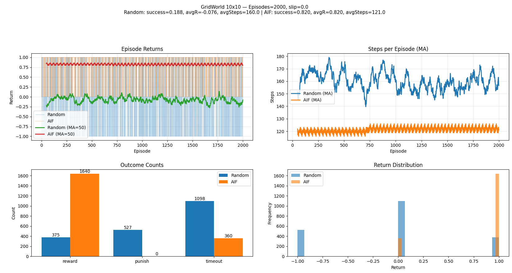
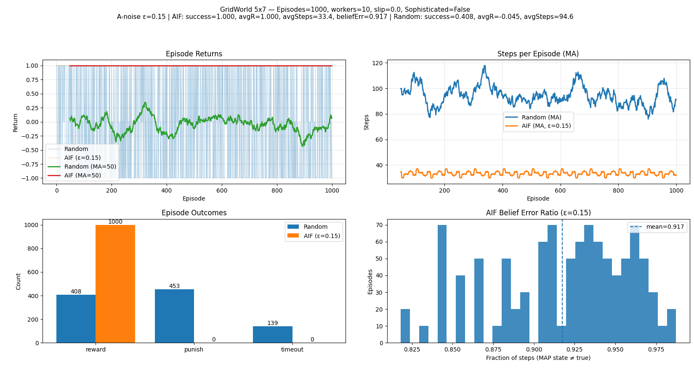
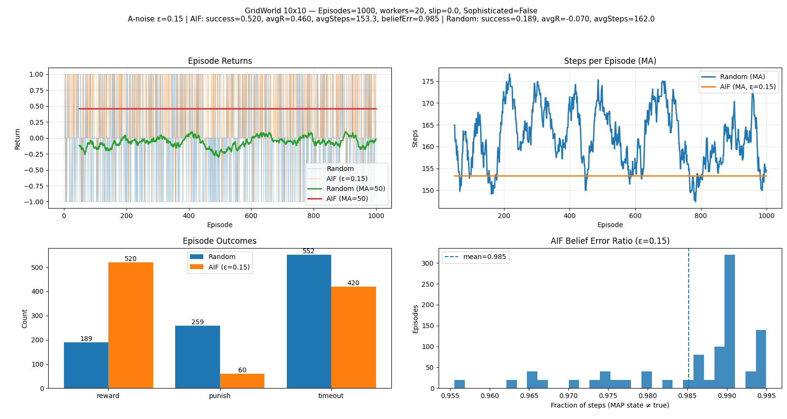
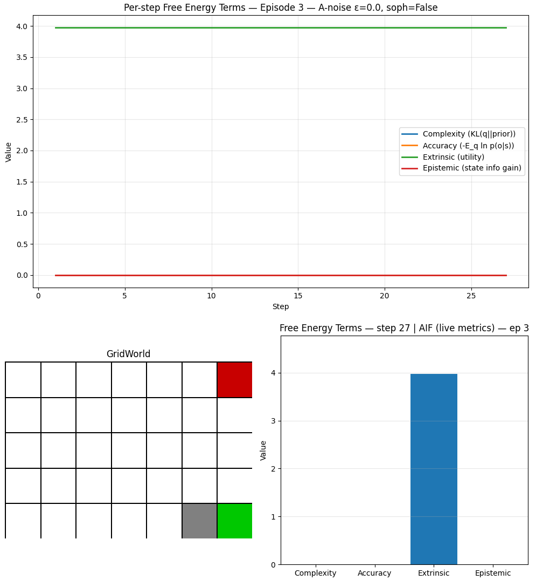

# Active Inference for Fun

Tiny, transparent experiments in **Active Inference** using [pymdp](https://github.com/infer-actively/pymdp?utm_source=chatgpt.com) and [gymnasium](https://gymnasium.farama.org/).

Start from the **simplest possible** environments and agents, then add complexity **step-by-step**—so you can reason about each design choice and its cognitive implications.

&nbsp;&nbsp;&nbsp;&nbsp;&nbsp;&nbsp;Goal: a **parsimonious, scientifically minded** playground to study cognition, building up difficulty “evolutionarily” (fully observable → partially observable; single factor → multi-factor; single modality → multi-modal; deterministic → noisy; etc.).


# Active Inference Formulation Notes

## Free Energy

### Variational Free Energy

Variational Free Energy starts with the following expression:

$$
\begin{aligned}
F_{\pi} & = \mathbb{E}_{q(s|\pi)} \left[\ln{\frac{q(s|\pi)}{p(o,s|\pi)}}\right] \\
& = \mathbb{E}_{q(s|\pi)} \left[\ln{q(s|\pi)} - \ln{p(o,s|\pi)}\right] \\
& = \mathbb{E}_{q(s|\pi)} \left[\ln{q(s|\pi)} - \ln{p(s|\pi)}\right] - \mathbb{E}_{q(s|\pi)} \left[\ln{p(o|s,\pi)}\right] \\
& = D_{KL}\left[q(s|\pi) || p(s|\pi)\right] - \mathbb{E}_{q(s|\pi)} \left[\ln{p(o|s,\pi)}\right]
\end{aligned}
$$

Let us extract the meaning of the Variational Free Energy.

The following expression is the **Complexity term**, which is the penalty for moving far from prior beliefs:

$$
D_{KL}\left[q(s|\pi) || p(s|\pi)\right]
$$

And the following one is the **Accuracy term**, which tells us how well the model predicts current observations:

$$
\mathbb{E}_{q(s|\pi)} \left[-\ln{p(o|s,\pi)}\right]
$$

---

### Expected Free Energy

Expected Free Energy starts with the following expression:

$$
\begin{aligned}
G_{\pi} &= \mathbb{E}_{q(o, s|\pi)} \left[\ln{\frac{q(s|\pi)}{p(o,s|\pi)}}\right] \\
&= \mathbb{E}_{q(o, s|\pi)} \left[\ln{q(s|\pi)} - \ln{p(o,s|\pi)}\right] \\
&= \mathbb{E}_{q(o, s|\pi)} \left[\ln{q(s|\pi)} - \ln{p(s|o, \pi)}\right] - \mathbb{E}_{q(o|\pi)} \left[\ln{p(o|\pi)}\right] \\
&\approx \mathbb{E}_{q(o, s|\pi)} \left[\ln{q(s|\pi)} - \ln{q(s|o, \pi)}\right] - \mathbb{E}_{q(o|\pi)} \left[\ln{p(o|C)}\right] \\
&= -\mathbb{E}_{q(o, s|\pi)} \left[\ln{q(s|o, \pi)} - \ln{q(s|\pi)}\right] - \mathbb{E}_{q(o|\pi)} \left[\ln{p(o|C)}\right] \\
&= -\mathbb{E}_{q(s|o,\pi)q(o|\pi)} \left[\ln{q(s|o, \pi)} - \ln{q(s|\pi)}\right] - \mathbb{E}_{q(o|\pi)} \left[\ln{p(o|C)}\right] \\
&= -\mathbb{E}_{q(o|\pi)} \left[ \mathbb{E}_{q(s|o,\pi)} \left[\ln{q(s|o, \pi)} - \ln{q(s|\pi)}\right] \right] - \mathbb{E}_{q(o|\pi)} \left[\ln{p(o|C)}\right] \\
&= -\mathbb{E}_{q(o|\pi)} \left[D_{KL}\left[q(s|o,\pi) || q(s|\pi)\right] \right] - \mathbb{E}_{q(o|\pi)} \left[\ln{p(o|C)}\right]
\end{aligned}
$$

Let us extract the meaning from the Expected Free Energy expression.

The following term is the **Extrinsic (utility term)**, which measures how much the predicted outcomes \(O\) deviate from preferred outcomes encoded in \(p(o)\) (which comes from the \(C\) matrix). If \(p(o)\) is high for some outcomes, policies leading to those outcomes have lower risk. It is **goal-directed** — the instrumental part of planning.

$$
\mathbb{E}_{q(o|\pi)} \left[-\ln{p(o|C)}\right]
$$

The following term is the **Epistemic (state information gain)**, which measures how much the agent expects to learn about hidden states \(s\) from future observations under policy \(\pi\). It is high when predicted observations would strongly reduce uncertainty about the hidden causes of sensory input. It is **curiosity-driven** — the exploratory part of planning.

$$
\mathbb{E}_{q(o|\pi)} \left[D_{KL}\left[q(s|o,\pi) || q(s|\pi)\right] \right]
$$


## Contents

- Minimal `N×M` **GridWorld** (deterministic walls, reward cell, punish cell)
- Text / **graphical renderer** (single persistent window, dynamic updates)
- **Active Inference** agent factory `(A, B, C, D)` tailored to GridWorld
- Batch **experiments & plots** (random vs AIF; sequential & parallel)
- Live demo: watch random episodes then AIF episodes in one window
- Roadmap: POMDP variants, multi-factor control, multi-modal outcomes, learning


## Repository Structure

```
Active_Inference_for_Fun/Environments/
├─ gridworld_env.py                 # Gymnasium env: N×M grid, reward & punish tiles
├─ ai_agent_factory.py              # build_gridworld_agent(): constructs A,B,C,D & Agent
├─ run_gridworld_stats.py           # random baseline: many episodes, plots results
├─ run_gridworld_aif_vs_random.py   # AIF vs Random, sequential or parallel (processes)
├─ run_gridworld_live_demo.py       # live dynamic render: random then AIF episodes
└─ README.md
```

## Installation

Python ≥ 3.9 recommended.

```bash
# (optional) create a fresh environment
python -m venv .venv
source .venv/bin/activate     # Windows: .venv\Scripts\activate

# core deps
pip install --upgrade pip
pip install numpy matplotlib gymnasium

# pymdp (pick one)
pip install pymdp             # if available in your index
# or from source:
# pip install git+https://github.com/infer-actively/pymdp.git
```

&nbsp;&nbsp;&nbsp;&nbsp;&nbsp;&nbsp;If `pymdp` API differs across versions, the code includes small compatibility shims (e.g., scalar vs list observations, `sample_action()` return types).

## Quick Start

1. ### To run a minimal environment smoke test run the following command

`python run_gridworld_human.py`

<video src="https://github.com/user-attachments/assets/c61f2118-13a9-4ffa-a31b-eabc1de233f9" 
       width="30%" 
       loop>
</video>

2. ### Batch statistics (random baseline)

```bash
python run_gridworld_stats.py --episodes 2000

Episodes:        2000
Success rate:    0.429
Punish rate:     0.455
Timeout rate:    0.117
Avg return:      -0.025
Avg steps:       91.95
```


3. ### AIF vs Random (with optional parallelism)

```bash
python run_gridworld_aif_vs_random.py --episodes 1000 --workers 40

=== Summary (Random) ===
 success_rate: 0.431
  punish_rate: 0.455
 timeout_rate: 0.114
   avg_return: -0.024
    avg_steps: 91.964
counts: {'reward': 431, 'timeout': 114, 'punish': 455}

=== Summary (AIF) ===
 success_rate: 1.0
  punish_rate: 0.0
 timeout_rate: 0.0
   avg_return: 1.0
    avg_steps: 33.08
counts: {'reward': 1000}
```


```bash

python run_gridworld_aif_vs_random.py --episodes 2000 --workers 60 --cols 10 --rows 10 --reward-pos "9, 9" --punish-pos "0, 9"

=== Summary (Random) ===
 success_rate: 0.1875
  punish_rate: 0.2635
 timeout_rate: 0.549
   avg_return: -0.076
    avg_steps: 160.0365
counts: {'timeout': 1098, 'reward': 375, 'punish': 527}

=== Summary (AIF) ===
 success_rate: 0.69
  punish_rate: 0.0
 timeout_rate: 0.31
   avg_return: 0.69
    avg_steps: 126.71
counts: {'timeout': 620, 'reward': 1380}
```


```bash

python run_gridworld_aif_vs_random.py --episodes 2000 --workers 60 --cols 10 --rows 10 --reward-pos "9, 9" --punish-pos "0, 9"  --policy-len 5

=== Summary (Random) ===
 success_rate: 0.1875
  punish_rate: 0.2635
 timeout_rate: 0.549
   avg_return: -0.076
    avg_steps: 160.0365
counts: {'timeout': 1098, 'reward': 375, 'punish': 527}

=== Summary (AIF) ===
 success_rate: 0.82
  punish_rate: 0.0
 timeout_rate: 0.18
   avg_return: 0.82
    avg_steps: 120.96
counts: {'reward': 1640, 'timeout': 360}

```



4. ### AIF vs Random with observations noise (with optional parallelism)

```bash
python run_gridworld_obs_noise.py --workers 10 --episodes 1000

=== Summary (Random) ===
 success_rate: 0.408
  punish_rate: 0.453
 timeout_rate: 0.139
   avg_return: -0.045
    avg_steps: 94.594
counts: {'reward': 408, 'timeout': 139, 'punish': 453}

=== Summary (AIF, noisy A) ===
 success_rate: 1.0
  punish_rate: 0.0
 timeout_rate: 0.0
   avg_return: 1.0
    avg_steps: 33.41
counts: {'reward': 1000}
 belief_error_ratio (mean over episodes): 0.917
```




```bash
python run_gridworld_obs_noise.py --workers 20 --episodes 1000 --cols 10 --rows 10 --reward-pos "9, 9" --punish-pos "0, 9"

=== Summary (Random) ===
 success_rate: 0.189
  punish_rate: 0.259
 timeout_rate: 0.552
   avg_return: -0.07
    avg_steps: 161.987
counts: {'timeout': 552, 'reward': 189, 'punish': 259}

=== Summary (AIF, noisy A) ===
 success_rate: 0.52
  punish_rate: 0.06
 timeout_rate: 0.42
   avg_return: 0.46
    avg_steps: 153.3
counts: {'reward': 520, 'timeout': 420, 'punish': 60}
 belief_error_ratio (mean over episodes): 0.985
```




4. ### Live demo (dynamic window)

```bash
python run_gridworld_live_demo.py --episodes-random 4 --episodes-aif 3 --fps 12 --seed 58457
[RANDOM] Episode 1: return=1.00, steps=184
[RANDOM] Episode 2: return=1.00, steps=31
[RANDOM] Episode 3: return=1.00, steps=24
[RANDOM] Episode 4: return=0.00, steps=200
[AIF] Episode 1: return=1.00, steps=11
[AIF] Episode 2: return=1.00, steps=10
[AIF] Episode 3: return=1.00, steps=15
```

https://github.com/user-attachments/assets/f199d457-7d89-4c75-bcbe-2354d41181f9


5. ### Analyzing metrics (**Complexity, Accuracy, Extrinsic and Epistemic**)

This section is to analyze how the main four terms defined in the previous section vary as we run an episode of this very simple grid world.
The main idea is to demonstrate conceptually what are the main things that these four terms entail in regards to active inference.

As shown in the examples bellow, when we run an episode, the only value greater than 0 is the extrinsic Utility throughout the whole episode while the others are all 0.


```shell
python run_gridworld_live_metrics.py --fps 10
[Episode 1] return=1.00, steps=14
[Episode 2] return=1.00, steps=33
[Episode 3] return=1.00, steps=27
All episodes complete: [(1.0, 14), (1.0, 33), (1.0, 27)]
``` 




Why is this happening?

Short answer: that pattern is exactly what we should see in our current setup (fully observable, deterministic dynamics, sharp prior), so nothing’s “wrong.”

Lets unfold this in more detail.

1. **Fully observable A (≈ identity) & deterministic B**

    . After each step we set the prior for the next step as $prior_s = B_uq_s$.
   
    . The new observation is perfectly informative: the posterior $q(s)$ collapses to the true state, which equals the predicted state.
   
    . $\\Rightarrow$ **Complexity** $D_{KL}({q(s)}\parallel{prior_s}) = 0$ (posterior matches prior).

    . With $A \approx identity, p(o_t∣s^*) = 1$ at the true state $\rightarrow −\mathbb{E}_q[ln⁡ p(o_t⁣∣s)] = 0$.

    . **Epistemic** (1-step info gain) vanishes: for each possible $o, {q(s⁣∣o)}\approx{q(s)}$ (no uncertainty to reduce), so expected $KL = 0$.

3. **Extrinsic > 0**

    . We compute $\mathbb{E}_{q(o)}[−ln ⁡p(o∣C)]$.

    . Unless our preferences $p(o∣C)$ put probability $\sim{1}$ on the actually observed outcome at every step, this expectation is **positive**. That’s why our utility bar moves, while the others don’t.


#### **How to make the other bars move (and why)**

If we want non-zero **Complexity**, **Accuracy**, **Epistemic**, we have to introduce mismatch or uncertainty:

. $\textbf{Accuracy} > 0$ (likelihood cost):
    . We have to add observation noise: `--a-noise 0.2` (so $\textbf{A}$ not identity).
