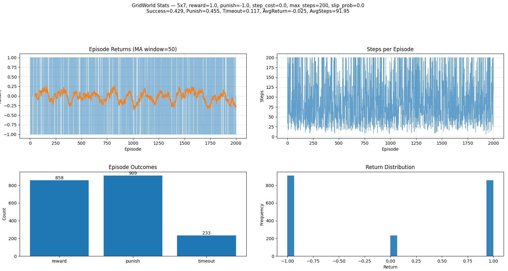
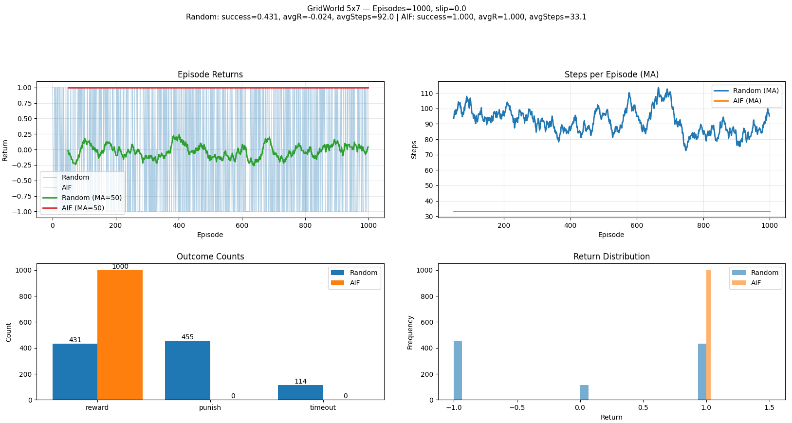
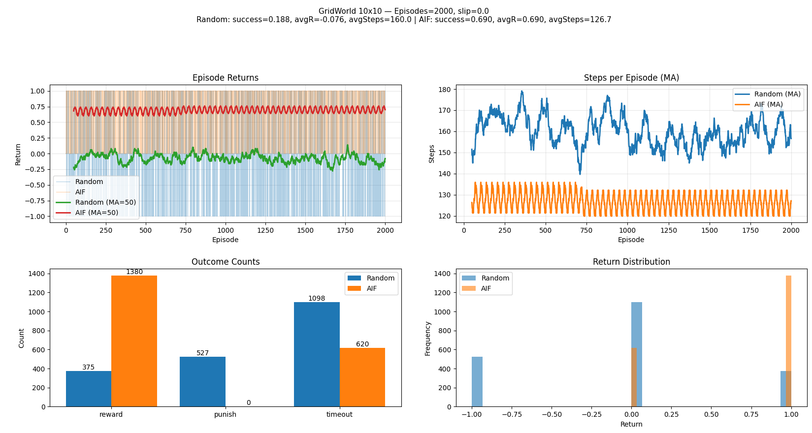

# Active Inference for Fun

Tiny, transparent experiments in **Active Inference** using [pymdp](https://github.com/infer-actively/pymdp?utm_source=chatgpt.com) and [gymnasium](https://gymnasium.farama.org/).

Start from the **simplest possible** environments and agents, then add complexity **step-by-step**—so you can reason about each design choice and its cognitive implications.

&nbsp;&nbsp;&nbsp;&nbsp;&nbsp;&nbsp;Goal: a **parsimonious, scientifically minded** playground to study cognition, building up difficulty “evolutionarily” (fully observable → partially observable; single factor → multi-factor; single modality → multi-modal; deterministic → noisy; etc.).

## Contents

- Minimal `N×M` **GridWorld** (deterministic walls, reward cell, punish cell)
- Text / **graphical renderer** (single persistent window, dynamic updates)
- **Active Inference** agent factory `(A, B, C, D)` tailored to GridWorld
- Batch **experiments & plots** (random vs AIF; sequential & parallel)
- Live demo: watch random episodes then AIF episodes in one window
- Roadmap: POMDP variants, multi-factor control, multi-modal outcomes, learning

## Repository Structure

```
Active_Inference_for_Fun/Environments/
├─ gridworld_env.py                 # Gymnasium env: N×M grid, reward & punish tiles
├─ ai_agent_factory.py              # build_gridworld_agent(): constructs A,B,C,D & Agent
├─ run_gridworld_stats.py           # random baseline: many episodes, plots results
├─ run_gridworld_aif_vs_random.py   # AIF vs Random, sequential or parallel (processes)
├─ run_gridworld_live_demo.py       # live dynamic render: random then AIF episodes
└─ README.md
```

## Installation

Python ≥ 3.9 recommended.

```bash
# (optional) create a fresh environment
python -m venv .venv
source .venv/bin/activate     # Windows: .venv\Scripts\activate

# core deps
pip install --upgrade pip
pip install numpy matplotlib gymnasium

# pymdp (pick one)
pip install pymdp             # if available in your index
# or from source:
# pip install git+https://github.com/infer-actively/pymdp.git
```

&nbsp;&nbsp;&nbsp;&nbsp;&nbsp;&nbsp;If `pymdp` API differs across versions, the code includes small compatibility shims (e.g., scalar vs list observations, `sample_action()` return types).

## Quick Start

1. ### To run a minimal environment smoke test run the following command

`python run_gridworld_human.py`

<video src="https://github.com/user-attachments/assets/c61f2118-13a9-4ffa-a31b-eabc1de233f9" 
       width="30%" 
       loop>
</video>

2. ### Batch statistics (random baseline)

```bash
python run_gridworld_stats.py --episodes 2000

Episodes:        2000
Success rate:    0.429
Punish rate:     0.455
Timeout rate:    0.117
Avg return:      -0.025
Avg steps:       91.95
```


3. ### AIF vs Random (with optional parallelism)

```bash
python run_gridworld_aif_vs_random.py --episodes 1000 --workers 40

=== Summary (Random) ===
 success_rate: 0.431
  punish_rate: 0.455
 timeout_rate: 0.114
   avg_return: -0.024
    avg_steps: 91.964
counts: {'reward': 431, 'timeout': 114, 'punish': 455}

=== Summary (AIF) ===
 success_rate: 1.0
  punish_rate: 0.0
 timeout_rate: 0.0
   avg_return: 1.0
    avg_steps: 33.08
counts: {'reward': 1000}
```




```bash

python run_gridworld_aif_vs_random.py --episodes 2000 --workers 60 --cols 10 --rows 10 --reward-pos "9, 9" --punish-pos "0, 9"

=== Summary (Random) ===
 success_rate: 0.1875
  punish_rate: 0.2635
 timeout_rate: 0.549
   avg_return: -0.076
    avg_steps: 160.0365
counts: {'timeout': 1098, 'reward': 375, 'punish': 527}

=== Summary (AIF) ===
 success_rate: 0.69
  punish_rate: 0.0
 timeout_rate: 0.31
   avg_return: 0.69
    avg_steps: 126.71
counts: {'timeout': 620, 'reward': 1380}
```



4. ### Live demo (dynamic window)

```bash
python run_gridworld_live_demo.py --episodes-random 4 --episodes-aif 3 --fps 12 --seed 58457
[RANDOM] Episode 1: return=1.00, steps=184
[RANDOM] Episode 2: return=1.00, steps=31
[RANDOM] Episode 3: return=1.00, steps=24
[RANDOM] Episode 4: return=0.00, steps=200
[AIF] Episode 1: return=1.00, steps=11
[AIF] Episode 2: return=1.00, steps=10
[AIF] Episode 3: return=1.00, steps=15
```

https://github.com/user-attachments/assets/f199d457-7d89-4c75-bcbe-2354d41181f9


